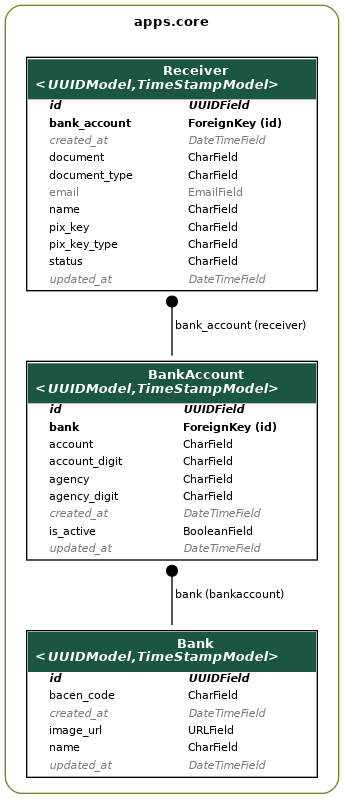

# Python PIX Receivers REST API

#### An API for registering PIX Receivers.

## :bookmark: Summary

  - [:gear: Project Decisions](#gear-project-decisions)
  - [:ballot\_box\_with\_check: Requirements](#ballot_box_with_check-requirements)
  - [:open\_file\_folder: Stack](#open_file_folder-stack)
  - [:rocket: Installation and Setup](#rocket-installation-and-setup)
    - [Step 0: Install Docker and Docker Compose](#step-0-install-docker-and-docker-compose)
  - [Step 0.5: Set Environment Variables](#step-05-set-environment-variables)
    - [Step 1: Build Image](#step-1-build-image)
    - [Step 2: Deploy Images and Populate the Database](#step-2-deploy-images-and-populate-the-database)
  - [:skull: Run Tests](#skull-run-tests)
  - [:lock: Authentication and Authorization](#lock-authentication-and-authorization)
  - [:wrench: Contributing](#wrench-contributing)
  - [:computer: Author](#computer-author)

## :gear: Project Decisions

The [main screen](https://www.figma.com/proto/8zSuDeDe8yI9zxP2mVKZnp/Teste-%7C-Dev?page-id=0%3A1&node-id=0%3A301&viewport=560%2C387%2C0.21&scaling=min-zoom&starting-point-node-id=0%3A86) of the Mockup shows columns named "Banco", "Agencia" and "Conta". Thus, I have designed this backend so it will be able to provide the necessary data to display such elements in the frontend.

This way, we have three relations: Receiver, Bank and BankAccount.



The Bank's `bacen_code` field represents the bank code from Banco Central and the `image_url` field is supposed to receive an url for the image to be displayed on the screen. BankAccount has necessary fields to retrieve one's bank account information with fields such as `account`, `agency`, etc.

Finally, the Receiver relation is responsible to hold the `name`, `document`,`pix_key`, `pix_key_type`, `email` and `status`. There is also the `document_type` field, which is responsible to hold information if the document is of type CPF or CNPJ. The `status` field not only is able to hold values like `RASCUNHO` and `VALIDADO`, but also `INVALIDO`.

The idea is that once a create Receiver request is received by the backend, it will assign a default BankAccount with `account="0000"` and `agency="0000000"`, also related to another default Bank. This way, once the new Receiver is created it will be possible to **signal an asynchronous worker** to validate if the input data is correct and that it is registered by any bank in Brazil. Also, there is an unique constraint rule for the `document`, `pix_key` and `pix_key_type` in the Receiver relation in order to avoid duplicates.

Because of this unique constraint, the values for the fields `document`, `pix_key` and `pix_key_type` are stored **unmasked** in the database. This way, it saves space by not saving unnecessary characters and it avoids duplicates if an user would register a new receiver by typing the CPF once with a masked value and another with an unmasked value.

Even though values are stored with unmasked values, they are some that will be retrieved with their appropriate value masks. I decided to keep the field `pix_key` being retrieved with an unmasked value. If the necessity of masking it comes in the future, there are already functions defined that are ready for it.

This is the expected return on creating or retrieving a receiver:

```
{
    "id": "cc029a8e-6648-440e-8f2a-a820a113e6b3",
    "name": "Teste",
    "document_type": "CPF",
    "document": "123.456.789-68",
    "pix_key_type": "EMAIL",
    "pix_key": "GDACO001@GMAIL.COM",
    "email": "NOTIFICATION@GMAIL.COM",
    "status": "RASCUNHO",
    "bank_account": {
        "bank": {
            "name": "default",
            "bacen_code": "000",
            "image_url": "https://www.s3-image_url.com"
        },
        "agency": "0000",
        "agency_digit": "0",
        "account": "0000000",
        "account_digit": "0",
        "is_active": true
    },
    "created_at": "2023-02-16T06:16:23.355548Z",
    "updated_at": "2023-02-16T06:16:23.355565Z"
}
```

Furthermore, it was also necessary to create more complex filters since field values are stored as unmasked values. Currently, fields are also unmasked and properly treated when they are searched. Also, I have added a feature to search the required fields as a list of values. This way, it is possible to filter multiple `pix_keys` at the same time by searching like `?pix_key=gdaco001@gmail.com,103.555.304-68`.

The constraint for updating values if the `status` is `VALIDADO` is applied to both **PATCH** and **PUT** methods.

The database can be populated with arbitrary random values by the ReceiverFactory class, which is used both for testing and for creating new inputs in the database. To initially populate the database, please check the setup guide below. Once the services are up and running, it is possible to access the `admin` page at `https://localhost:1337/admin/` and the Swagger page at `https://localhost:1337/v1/docs`.


## :ballot_box_with_check: Requirements
- :whale: [docker](https://www.docker.com/get-started)
- :octopus: [docker-compose](https://docs.docker.com/compose/install/)

## :open_file_folder: Stack
- :whale: Docker
- :octopus: Docker Compose
- :snake: Python 3.10
- :elephant: PostgreSQL 12
- :rocket: Django
- :gift: Django REST Framework
- :gear: Nginx

## :rocket: Installation and Setup
### Step 0: Install Docker and Docker Compose

__Skip__ this step if you already have Docker and Docker Compose installed on your operating system.

**Update packages**:
```shell
sudo apt update && sudo apt upgrade -y
```
**Install prerequisite packages**:
```shell
sudo apt install apt-transport-https ca-certificates curl software-properties-common
```
**Add the GPG key from the official Docker repository**:
```shell
curl -fsSL https://download.docker.com/linux/ubuntu/gpg | sudo apt-key add -
```
**Add the official Docker repository to APT sources**:
```shell
sudo add-apt-repository \
"deb [arch=amd64] https://download.docker.com/linux/ubuntu $(lsb_release -cs) stable"
```
**Update the Ubuntu packages list**:
```shell
sudo apt update
```
**Verify the Docker repository**:
```shell
apt-cache policy docker-ce
```
**Install Docker Comunity Edition**:
```shell
sudo apt install docker-ce
```
**Check the status installation status**: It should return __active (running)__
```shell
sudo systemctl status docker
```
**Install Docker Compose**:
```shell
sudo curl -L "https://github.com/docker/compose/releases/download/1.27.4/docker-compose-$(uname -s)-$(uname -m)" -o /usr/local/bin/docker-compose
```
**Apply executable permissions for the downloaded binary**:
```shell
sudo chmod +x /usr/local/bin/docker-compose
```
**Check if Docker Compose has been successfully installed**:
```shell
docker-compose --version
```
**Create the docker group**:
```shell
sudo groupadd docker
```
**Add your user to the docker group**:
```shell
sudo usermod -aG docker $USER
 ```
 **Activate changes to the group**:
```shell
newgrp docker
 ```
Docker is now installed and ready to use in your machine. It is, however, recommended to log-off and log back in so group changes take effect. If you are on a virtual machine, it is recommended to shut down and start it again.

## Step 0.5: Set Environment Variables

Some environment variables must be set in order to properly run the project. Please, copy the variables below to the __.dev.env__ file and proceed to the next steps.

```
SECRET_KEY=b!+q)h#vk3lz+lep2@d5=t*m7$grwtkl_(k-f9bt@75k-=omn4
DATABASE_URL=postgresql://postgres:postgres@db:5432/postgres
```

### Step 1: Build Image
The Docker image can be built by running:
```shell
$ make build-api
```

### Step 2: Deploy Images and Populate the Database

Services can be deployed by running:
```shell
$ make deploy-api
```
The ```make deploy-api``` command is responsible for deploying the __api service__, __nginx__ and __database__. It also creates an admin user with login `admin` and password `admin` and inputs default data to Bank and BankAccount. If you run the `docker ps` command, you should see the containers up and running.

You can add an arbitrary number of random receivers into the Receiver relation by running:
```shell
$ make add-random-data-to-db-in-docker 30
```
It is also possible to shutdown the services by running:
```shell
$ make shutdown-api
```

## :skull: Run Tests
__Please, make sure the database container is up before running the automated tests.__

You will be able to see the coverage report by running the steps below.

```sh
$ cp .dev.env .env
$ make test
```
However, it is necessary to have an environment with the necessary packages properly installed. I would highly recommend using [pyenv](https://github.com/pyenv/pyenv) + [poetry](https://python-poetry.org/) to manage environment and packages.
## :lock: Authentication and Authorization
- This API contains no authentication or authorization. However, a default admin user is created automatically once you run the ```make deploy-api``` command. With these credentials, you are able to access the `admin` page to visualize data from the relations.

## :wrench: Contributing
[](https://github.com/gdaco001/django-crud-pix/issues/new)

If you find any problem or have a suggestion, please [open an issue](https://github.com/gdaco001/django-crud-pix/issues/new).

## :computer: Author

* **Gabriel da Costa** - *Software Developer*
